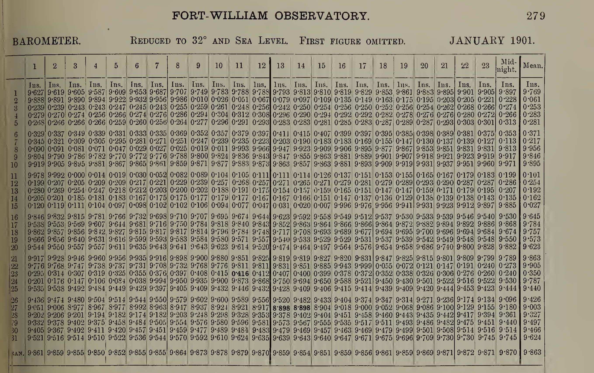

Printed tables from Weatherrescue Ben Nevis project
===================================================

   Ben Nevis project sample table - half a page.

The 'Meteorology of Ben Nevis' project `published 1.6 million weather observations in the Transactions of the Royal Society of Edinburgh <https://brohan.org/OCR-weatherrescue/source.html>`_ - around 2000 pages of printed tables.

These observations have already been transcribed, by the `Weather rescue Ben Nevis project <https://www.zooniverse.org/projects/edh/weather-rescue-ben-nevis>`_, and this makes them a great choice for testing new transcription methods. We have combined the published images and transcribed data to make a `validation dataset <https://brohan.org/OCR-weatherrescue/index.html>`_.

