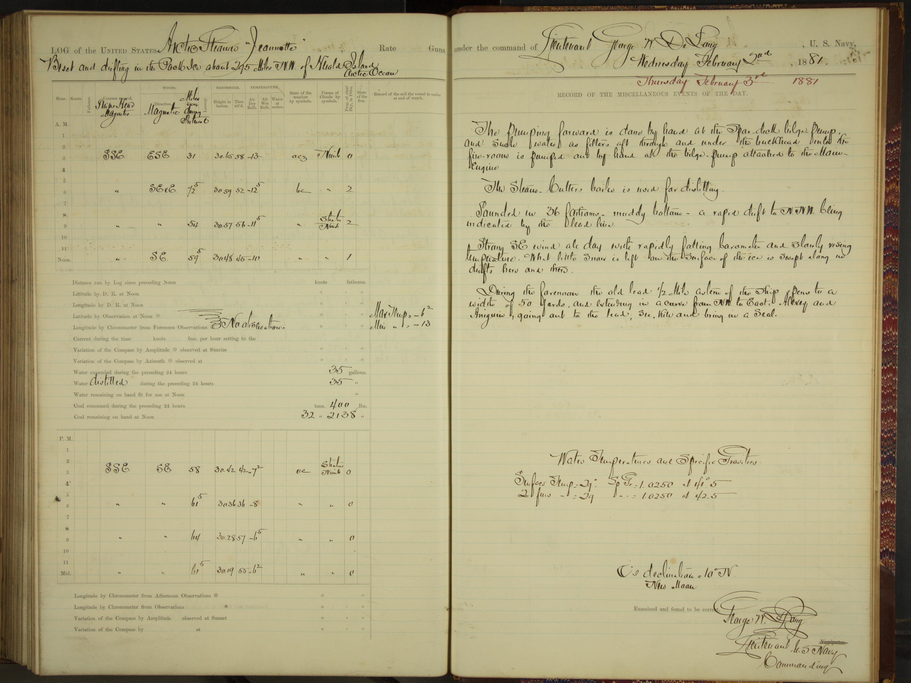

Manuscript tables from the logbook of USS Jeannette
===================================================

   Jeannette sample image - double page.

The `logbook of USS Jeannette <https://catalog.archives.gov/id/6919191>`_, on its `famous arctic voyage starting in 1879 <https://en.wikipedia.org/wiki/USS_Jeannette_(1878)>`_ is in the collection of the `US National Archives <https://www.archives.gov/>`_. It has handwritten data entries onto a printed form. It was imaged and transcribed as part of the `oldWeather-Arctic Project <https://classic.oldweather.org/ships/50a27fd77438ae05bd000002>`_.

